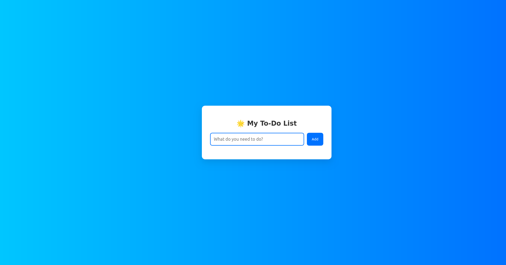

# Modern Todo List with React

A modern, responsive Todo List application built with React. Keep track of your tasks with a clean and intuitive interface.

## 🌐 Live Demo

Visit the live application at: [https://makebelief.github.io/modern-Todo-List-with-react](https://makebelief.github.io/modern-Todo-List-with-react)



## ✨ Features

- Add, complete, and delete tasks
- Clean and modern user interface
- Responsive design for all devices
- Real-time updates

## 🚀 Local Development

If you want to run the application locally:

1. Clone the repository:
   ```bash
   git clone https://github.com/makebelief/modern-Todo-List-with-react.git
   cd modern-Todo-List-with-react
   ```

2. Install dependencies:
   ```bash
   npm install
   ```

3. Start the development server:
   ```bash
   npm start
   ```

4. Open [http://localhost:3000](http://localhost:3000) in your browser

## 🛠️ Technologies Used

- React
- CSS3
- JavaScript (ES6+)
- GitHub Pages for deployment

## 📝 Notes

- Tasks are stored in memory and will be cleared upon page refresh
- The application is best viewed in modern browsers
- For any issues or suggestions, please open an issue in the GitHub repository

## 📜 License

This project is licensed under the ISC License - see the [LICENSE](LICENSE) file for details.
